# Handwriting Recognition Project

This project implements a handwriting recognition system using deep learning. It also includes a Flask-based web service for easy text extraction from images. The system is containerized using Docker for easy deployment and scalability.

## 🌟 Features

- Deep learning-based handwriting recognition
- RESTful API for text extraction from images
- Web interface for easy file uploads 
=======
# Handwriting Recognition Project ✍️🖥️

This project is focused on developing a handwriting recognition system using machine learning models. It includes training, inference, and deployment components, leveraging various Python libraries and tools.

## Features 🌟

- Deep learning-based handwriting recognition
- RESTful API for text extraction from images
- Web interface for easy file uploads

- Docker support for containerized deployment
- Multiple trained models available
- Support for image segmentation and processing

## 🛠️ Technology Stack

- Python 3.x
- TensorFlow/Keras for deep learning
- Flask for web service
- OpenCV for image processing
- Docker for containerization
- Streamlit for visualization (optional)

## 📋 Prerequisites

- Python 3.x
- Docker (optional)
- GPU support (recommended for training)


## 🚀 Getting Started

### Local Setup

1. Clone the repository:
   ```bash
   git clone [repository-url]
   cd handwriting-project
   ```

2. Create a virtual environment and activate it:
   ```bash
   python -m venv venv
   source venv/bin/activate  # On Windows: venv\Scripts\activate
   ```

3. Install dependencies:
   ```bash
   pip install -r requirements.txt
   ```

4. Run the server:
   ```bash
   python server.py
   ```

### Docker Setup

1. Build the Docker image:
   ```bash
   docker-compose build
   ```

2. Run the container:
   ```bash
   docker-compose up
   ```

## 🔧 API Usage

### Endpoint: `/predict`

**Method:** POST

**Request:**
- Content-Type: multipart/form-data
- Body: image file

**Example using curl:**
```bash
curl -X POST http://localhost:5000/predict \
  -H "Content-Type: multipart/form-data" \
  -F "image=@/path/to/your/image.png"
```

## 📁 Project Structure

```
.
├── src/                    # Source code directory
├── segmentor/              # Image segmentation modules
├── data/                   # Training data
├── test_images/           # Test images
├── uploads/               # Uploaded images storage
├── outputs/               # Model outputs
├── server.py              # Flask server
├── train_and_inference.ipynb  # Training notebook
├── Dockerfile             # Docker configuration
├── docker-compose.yml     # Docker compose configuration
└── requirements.txt       # Python dependencies
```

## 🏃‍♂️ Training

The model training process is documented in `train_and_inference.ipynb`. Multiple trained models are available:
- ocr_model_50_epoch.weights.h5
- ocr_model_v4.weights.h5
- ocr_model_v5.weights.h5
- ocr_model_v8.weights.h5

## 📝 Model Performance

Training results and model performance metrics can be found in `epochs_result.txt`.

## 🤝 Contributing

Contributions are welcome! Please feel free to submit a Pull Request.

## 📄 License

Private 

## 👥 Authors

Nirajan KC, Ranjan Thakur

## 🙏 Acknowledgments

- Prof. Long Ma 
=======
## Project Structure 📂

- **data/**: Contains datasets used for training and inference.
  - `words/`: Directory for word-level data.
  - `page/`: Directory for page-level data.
  - `for_inference/`: Data prepared for inference.
  - `words.txt`: Metadata or annotations related to word images.

- **uploads/**: Directory for uploading files, possibly for inference or testing.

- **outputs/**: Contains output results from the model, such as predictions or processed images.

- **src/**: Source code for the project.
  - `main.py`: Main script for running the project.
  - `server.py`: Script to run the server for model inference.
  - `inference.py`: Handles the inference logic.
  - `app.py`: Possibly a web application interface.
  - `img_names_sequence.txt`: Sequence or list of image names.

- **segmentor/**: Contains segmentation logic, possibly for preprocessing images.

- **Model Files**: 
  - `ocr_model_v*.weights.h5`, `epoch50_our_ocr_pred_model.*`: Pre-trained model weights for OCR.

- **Configuration Files**:
  - `docker-compose.yml` and `Dockerfile`: For containerizing the application using Docker.
  - `.gitignore`, `.dockerignore`, `.gitattributes`: Configuration files for Git and Docker.

## Project Architecture 🏗️

The architecture of the project is designed to efficiently process and recognize handwritten text through a series of well-defined stages:

```mermaid
graph TD;
    A[Data Collection 📥] --> B[Data Preprocessing 🔄];
    B --> C[Model Training 🏋️‍♂️];
    C --> D[Model Evaluation 📊];
    D --> E[Model Deployment 🚀];
    E --> F[Web Interface 🌐];
    F --> G[User Interaction 👤];
    G -->|Feedback 🔄| A;
```



## Requirements 📦

The project requires the following Python packages, as specified in `requirements.txt`:

- TensorFlow, Keras for building and training models.
- Flask for creating a web server.
- OpenCV for image processing.
- Scikit-learn, SciPy for machine learning utilities.
- Streamlit for creating web applications.
- And many more listed in the `requirements.txt`.

## Setup and Installation ⚙️

1. **Clone the repository**:
   ```bash
   git clone <repository-url>
   cd Handwriting_Recognition_Project
   ```

2. **Install dependencies**:
   ```bash
   pip install -r requirements.txt
   ```

3. **Run the application**:
   - For Docker:
     ```bash
     docker-compose up
     ```
   - Directly using Python:
     ```bash
     python src/main.py
     ```

## Usage 🚀

- **Training**: Use the `train_and_inference.ipynb` notebook to train the model with your dataset.
- **Inference**: Run `server.py` to start the server and use the model for inference on new data.
- **Web Interface**: Use `app.py` to interact with the model through a web interface.

## Additional Insights 🌟

- **Scalability**: The use of Docker ensures that the application can be easily scaled and deployed across different environments without compatibility issues.
- **Extensibility**: The modular structure of the codebase allows for easy extension and integration of new features or models.

## Model Training 🏋️‍♂️

The model is trained using TensorFlow and Keras. Below is a simplified example of how the training process is set up:

```python
# Import necessary libraries
import tensorflow as tf
from tensorflow import keras

# Define the model architecture
model = keras.Sequential([
    keras.layers.Conv2D(32, (3, 3), activation='relu', input_shape=(128, 32, 1)),
    keras.layers.MaxPooling2D((2, 2)),
    keras.layers.Conv2D(64, (3, 3), activation='relu'),
    keras.layers.MaxPooling2D((2, 2)),
    keras.layers.Flatten(),
    keras.layers.Dense(128, activation='relu'),
    keras.layers.Dense(num_classes, activation='softmax')
])

# Compile the model
model.compile(optimizer='adam',
              loss='sparse_categorical_crossentropy',
              metrics=['accuracy'])

# Train the model
model.fit(train_images, train_labels, epochs=10, validation_data=(test_images, test_labels))
```

This code snippet provides a basic structure for training a convolutional neural network (CNN) for handwriting recognition. You can customize the architecture and parameters to suit your specific dataset and requirements.

